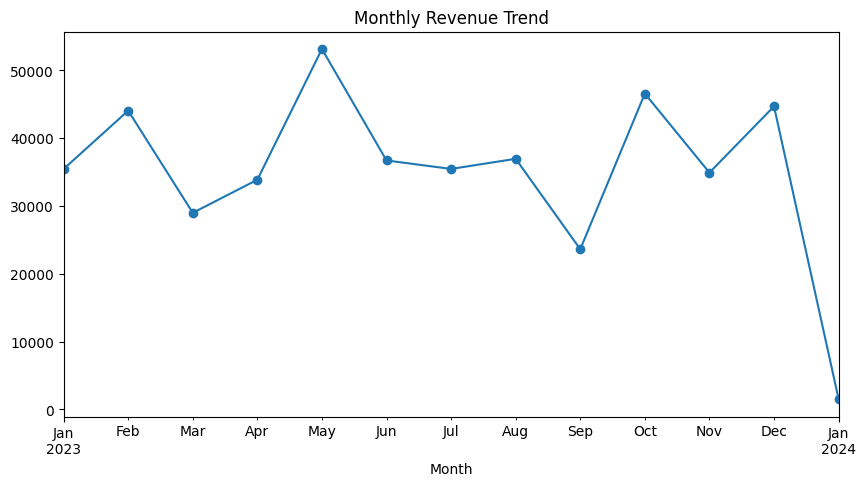
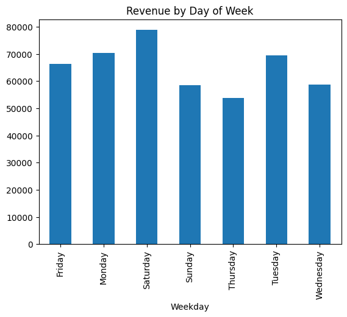

# Retail Sales - EDA Project

This project is an exploratory data analysis (EDA) on a retail sales dataset. 
The goal was to clean the data, look at basic statistics, study sales trends 
over time, understand customer/product behavior, and pull out some useful 
insights and recommendations for the business.

Done as part of the Oasis Infobyte Data Analytics Internship.

## What's in this project

- Data cleaning (missing values, duplicates)
- Descriptive stats (mean, median, mode, std dev)
- Time series analysis (monthly trend, day-of-week pattern)
- Customer and product analysis (category, gender, age group, top customers)
- Visualizations (bar charts, line plot, heatmap)
- Final recommendations based on the findings

## Folder structure
Retail Sales Eda/
├── data/
│   ├── raw/                 -> original dataset
│   └── processed/           -> cleaned dataset
├── notebooks/
│   └── retail_sales_eda.ipynb
├── charts/                  -> saved chart images
├── report/
│   └── findings_and_recommendations.md
├── requirements.txt
└── README.md
## Some key findings

- Sales don't show a steady growth trend, they go up and down through the 
  year - May and Q4 (Oct-Dec) were the strongest, September was the weakest.
- Saturday brings in the most revenue, Thursday the least.
- Electronics, Clothing, and Beauty are all pretty close in revenue - no 
  one category is dominating.
- Every customer in the dataset made only one purchase, so there are no 
  repeat customers at all, which is a pretty big insight for a retail 
  business (means retention is basically zero right now).
- Average spend between male and female customers is almost the same, so 
  gender isn't really a useful way to segment customers here.

Full write-up is in [report/findings_and_recommendations.md](./report/findings_and_recommendations.md)

## Charts

Monthly revenue trend, revenue by weekday, category revenue, and a 
weekday-vs-month heatmap are saved in the `charts/` folder. A couple of 
them below:

## Tools used

Python, Pandas, NumPy, Matplotlib, Seaborn, Jupyter Notebook

## How to run
pip install -r requirements.txt
jupyter notebook notebooks/retail_sales_eda.ipynb

## Author

Pranjal Chirkute
[LinkedIn](#) | [GitHub](https://github.com/pranjalchirkute25)
